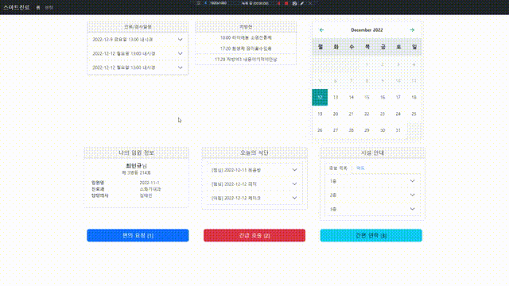
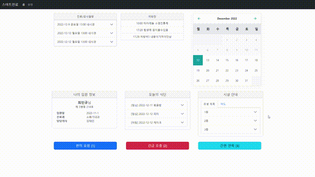

# webos-hospital

Simple webapp-based WebOS application

## Environment

- Bootstrap 5.2.3
- PopperJS [[2.11.6](https://popper.js.org/)]
- VanillaCalendar [[0.0.2](https://github.com/chrissy-dev/vanilla-calendar)]
- FontAwesome [[6.2.1](https://fontawesome.com/download)]
- Moment.js [[2.29.4](https://momentjs.com/)] (with locales version)

## Etc
HospitalServer project is the server which provides medical information with JSON/REST API but it also has dependency on another student's server.
I've added example response as comment in each Controller code so you can reconstruct the entire server service.

